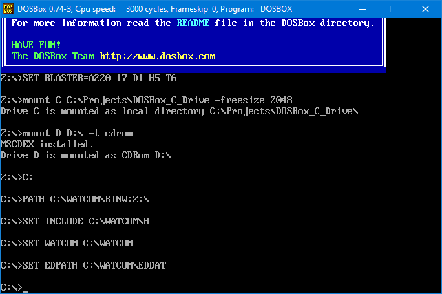

# Actua Soccer Code Analysis

# Notes 000 - The Source Code

## Background
On Aug 3ed 2017 Gremlin Interactive decided to release Actua Soccer source code to the world, for me that was great news. Acuta soccer was one of the first soccer games I played with my brother, we spent countless hours playing the game.  

We owned both Actua soccer, and Actua Soccer : Semi-Final edition. We first owned the Actua Soccer Semi-final edition, which if I remember correctly came bundled with other Gremlin games. To our surprise the semi-final edition came with only 5 teams (yes no joke only 5 teams) England, Czech Rep., France, Germany and Russia. With such a limited number of teams, it was not that much fun, so it did not take us long before we bought the vanilla version of Actua soccer which had forty-four national teams.  

Note: My guess that Gremlin release of semi-final edition was more of a marketing move, to release trimmed down version of actua soccer in bundles at a reduced price. The game never existed as a standalone. 

Those are the original CDs which me and my brother used back then on our super powerful Pentium 90MHz!  

Acuta Soccer CD  

  

Acuta Soccer Semi-Final CD  

    

Now both CDs are retired, spending the rest of their lives on my display shelf.  

  

I have compared both CDs content, and to my surprise both Actua soccer and Actua soccer semi-final edition are almost identical, the only difference is the "SOCCER.EXE". The semi-final version of actua soccer had all the required assets to run the vanilla version with all the forty-four teams. With that being said, if you had a semi-final version of the game and just replaced the "SOCCER.EXE" with the vanilla version of the EXE the game will start with no issue and you will get access to all forty-four teams, not only that, but also the copy protection of the semi-final CD will be accepted, and the game would run. (Indicating that even copy protection has not changed between those two releases). We will get into what in the EXE will make things work!   

  

The ```.INI``` and ```.PIF``` files will not impact the game content in any way, the ```DTEST.EXE``` is just a disk test binary that will not have an impact on the game.

Since Gremlin released the source code I wanted to spend some time looking into the released source code, but never got the time to do so, until recently. Here are some of my analysis and findings.  

Before we start there might be a few things you want to know. The next few bullet points are spoilers! so skip them if you are planning to explore the released source code, no matter what the outcome is, and end up with a big surprise.  
<details>
  <summary>Spoiler Warning</summary>
    <ul>
        <li>The source code is not what you think! :( It is not Actua Soccer source code, it an unfinished version of Euro96.</li>
        <li>The provided code is not complete, so it is not possible to compile this code using the source code only (but still possible to compile using provided Obj files).</li>
    </ul>
</details>

##  Compiling the Source Code
Building a legacy code is not the easiest thing to do, most of the tools and hardware needed for such a task are obsolete, and Actua Soccer code is no exception. First thing we will need to find out what IDE was used to compile the source code, and there are a few things that give away the correct answer. Here is a hint, when you start Actua soccer  

    

A message you almost saw starting most DOS game in 90's, do you see any hints in that? ```DOS/4GW``` is stripped-down version of DOS extender ```DOS/4G``` which was released with Watcom compilers in the 90s. So now that we know which compiler to use, let’s set up our development environment.  

Here is what we will need  
*  Some free space on your disk drive, I would say around 2GB is good enough  
*  DOS OS environment  
    Lots of choices here. You can chose any of the following  
    *  A machine running DOS (an old machine you have around)  
    *  Build your own DOS VM  
    *  [PCemu](https://pcem-emulator.co.uk/)  
    *  [DOSBox](https://www.dosbox.com/) (easiest option and the way we will use)  
*  Watcom C++ 10.6 (version 11 didn't work for me), you are on your own to get a copy of the original Watcom 10.6 CD.  
*  Copy of [Actua Soccer source code](https://www.gremlinarchive.com/index.php/2017/03/08/actua-soccer-source-code/)  
    * I would recommend downloading the zip file from Gremline archive or using the zip file provided in this repro. Note that most of the other Actua source code pushed into the GitHub repositories has their end line sequence converted to Unix format, which DOS is allergic to, you have been warned.  

### Setting DOS Environment  
So DOSBox will be our choice for DOS environment. Installing DOSBox is easy, just download the Windows MSI and complete installation with default installation settings.  

When the installation is complete, you should see the following in your start menu   

  

Before you start DOSBox, create a folder on your machine to mount as your ```C``` drive for your DOXBox.  

For me I created a new folder at the following path  

```
C:\Projects\DOSBox_C_Drive
```

In the empty folder create the following empty files  

```
C:\Projects\DOSBox_C_Drive\AUTOEXEC.BAT
C:\Projects\DOSBox_C_Drive\ICONFIG.SYS
```

Note: The above two files trick the WATCOM installer making it think it is running on a native DOS environment.  

Now extract Actua Soccer source code to that folder, I have extracted mine under the folder  

```
C:\Projects\DOSBox_C_Drive\SOCCER
```

Now head back to the DOSBox Shortcut in the start menu and select ```DOSBox 0.74-3 Options```, a text should open where setting could be edited. 

Search for ```[autoexec]``` section and add the following (modify those setting as needed, explanation of each line in next section)  

```
[autoexec]
# Lines in this section will be run at startup.
# You can put your MOUNT lines here.
mount C C:\Projects\DOSBox_C_Drive -freesize 2048
mount D D:\ -t cdrom
C:
PATH C:\WATCOM\BINW;%path%
SET INCLUDE=C:\WATCOM\H
SET WATCOM=C:\WATCOM
SET EDPATH=C:\WATCOM\EDDAT
```

#### Explanation 

```
mount C C:\Projects\DOSBox_C_Drive -freesize 2048
```

This would create a C drive in DOSBox that is mounted to the local folder ```C:\Projects\DOSBox_C_Drive```. The ```-freesize 2048``` parameter tells DOSBox the C Drive will be 2GB in size. 

```
mount D D:\ -t cdrom
```
Connects the drive ```D``` in DOSBox to my PC CD/DVD-ROM drive (```D:\```). The parameter ```-t cdrom``` tells DOSBox the mounted drive is a CD-ROM to load correct drivers for it.  

```
C:
```

Instructs DOSBox to switch ```C``` drive.  

```
PATH C:\WATCOM\BINW;%path%
SET INCLUDE=C:\WATCOM\H
SET WATCOM=C:\WATCOM
SET EDPATH=C:\WATCOM\EDDAT
```

We have not installed WATCOM yet but let us add those environment settings while we are at it. The above configuration is to set up the WATCOM environment that normally should be added to ```AUTOEXEC.BAT``` but due to DOSBox limitation it will not load the file on startup.  

All the above commands will run every time you start your DOSBox to save you some time, if you don't feel like editing your DOSBox config file you will simply have to type all those commands every time you start your DOSBox.  

Now Start your DOSBox and you should see something like this  

  

### Installing Watcom 10.6
So, you got your WATCOM CD or ISO. You should mount it and pass it to DOSBox as a CD-ROM.  

In my case I have an ISO that is mounted in windows as drive E, so I will need to pass it to DOSBox as a CD-ROM, so I ran  

```
mount E E:\ -t cdrom
```

Now switch to the mounted drive  

```
E:
```
  

Now run setup.exe  

```
SETUP.EXE
```

and you will be greeted with the following screen  

  

Now select ```Install the software on the hard disk``` and click ```OK```  

  

I will leave the installation directory to the default one and click ```OK```.  
Note: if you decide to change the directory, remember to update the environment setting to match your installation directory in the DOSBox configuration.  

Select ```Full Installation```, click ```OK```.  

    

Now click ```OK``` one more time to start coping files  

Once all the files are copied you will be prompted as follows  

    

Select ```Make all the modifications for you``` and click ```OK```  

Click ```OK``` on any popping window that confirms the changes.  

Congratulations you have installed WATCOM C++ Compiler.  

Now switch pack to C drive by typing  

```
C:
```

Now you’re all set to compile Actua Soccer source code, just navigate to the source code and compile it  

```
cd SOCCER
```

  

Now just type ```m``` and press enter!

```
m
```

  

Note: the command ```m``` runs the batch file ```m.bat``` which in turn runs the WATCOM compile command ```wmake /z```.  

Technically speaking nothing was compiled, the WATCOM compiler detects that none of the source files have changed, and nothing needs to be rebuilt.  

we can delete ```TEST.EXE``` and see if it gets re-created by the compiler.  

```
del TEST.exe
m
```

  

SWEET!!! The file ```TEST.EXE``` was created by the compiler this time, let’s run and see if it works!  

```
TEST.EXE
```

  

What in the world is this! Euro96! Actua soccer did not look like that! What is going on?  

Let’s play along and see what happens.  

 


  

That is disappointing, sadly that even looks like an unfinished prototype version of Euro96, no way to change player controls, no way to change settings, and no audio :(. 

UEFA Euro 96 England is a game released by Gremlin Interactive in 1996. Though it is based on Actua Soccer engine, the Euro 96 has modifications that the original Actua soccer did not have. Though that was not what I was expecting, Euro 96 shares the same 3D engine used for Actua Soccer and having some of the source code would help figure out how Actua soccer works, so let’s stay positive.  

### The Source Code
Now let us have a look at the source code! As I am digging though the code there are a lot of surprises.  

The source code folder contains a mix of scripts, source code, header files, log files, game assets and external libraries.  

Before we jump into the code, let us try to understand how WATCOM compiler works, if you come from Unix/Linux background you’re likely familiar with ```MAKEFILE```s.
Make files are just a set of instructions to tell WATCOM how to compile, link and generate and EXE program from the source code.

Here is how the ```TEST.EXE``` target in the Makefile 

```
object_files =	test.obj &
		euro_gen.obj euro_spt.obj euro_dsk.obj euro_mem.obj euro_grf.obj euro_var.obj &
		euro_sqd.obj euro_fix.obj euro_sel.obj euro_inf.obj euro_cnt.obj euro_usr.obj euro_win.obj &
		euro_inp.obj euro_mod.obj euro_net.obj euro_cmd.obj euro_gdv.obj euro_mat.obj euro_rnd.obj &
		euro_int.obj euro_fxd.obj &
		menu.obj results.obj unmangle.obj intronet.obj &
		control.obj mallocx.obj gamedata.obj audio.obj

test.exe	: $(object_files)
		wlink $(wlink_options) @INFO
```

A deeper look into the makefile, not all those Obj files have targets that build them from the source code. A good example is ```audio.obj``` which seems there is no target to build the ```audio.obj``` from the provided source code. Opening the ```audio.obj``` file with a hex-editor  you can see it was built off the file ```C:\TOIL\ACTUASOC\SOURCE\audio.c```, where ```audio.c``` was never provided in the released source code, what a bummer.  

The code compiles because the ```Obj``` files exist and the WATCOM compiler does not detect a change in the Source files.

The C++ ```main``` entry point can be found in two files ```TEST.CPP``` and ```FOOT.CPP```. But ```FOOT.CPP``` is not easy to compile with provided source code the CPP file included the following header that do not exists

```
#include "global.h"
#include "mouse.h"
#include "front.h"
```

Also, some header files are pointing to the wrong path, though that is an easy fix.

```
#include "eurofrnt\euro_int.h"
```

Some good news, I believe most of the missing files are not critical and can be re-created with little effort, or even better completely omitted. The good news does not end there! WATCOM comes with a disassembler, which would take an Obj files and generate an assembly out of the Obj, so the original logic can be retrieved if we put some effort into it.  

Actua Soccer original code partially exists in the provided source code (lots of it is commented out and needs to be re-enabled). 
Looking at the source, it was architected to have a front end and a back end. The front end consists of the game menus and the interface UI, also that includes the team’s data and players statistics, back end is the 3D engine that does all the heavy 3D graphics rendering. The good news is it does not seem that the back end changed that much.  

One major change from Actua soccer to Euro96 is what the game calls the "script" which is present in SCRIPT.96. This is simply all the team statistics, players’ names, couch etc. isolated in an external file, so it is easier to modify the game and release it under a different front end. Actua soccer previously hardcoded those values in the source code directly, where some are commented out and some is completely removed from code.  

Note: This explains why replacing the Semi-final edition exe with the vanilla brought in all 44 teams, Gremlin shipped all the assets for both versions and hardcoded the teams in the EXE for those versions.  

There is more to discover in the release code, it is still so much fun exploring how the game worked.

Finally, the released source code is under "Attribution-NonCommercial-NoDerivatives 4.0 International (CC BY-NC-ND 4.0)" which mean you can't do much with the source code, you are not allowed to modify and distribute it, for example re-create one of those missing CPP files, update the Makefile then sharing it with the world. All you can simply do is share it as is. With that being said, the best thing that can be done is simply understand the source code and write our own implementation from scratch.   
So future notes of Actua soccer will be more findings and analysis of the released code without any modifications.

### Random thoughts  
The file ```GAMEEQUS.PUB``` is out of place, seems to be for the game "Premier Manager 3" which is also a Gremlin Interactive title.  

Developers left their phone numbers in code comments !!!!!  


